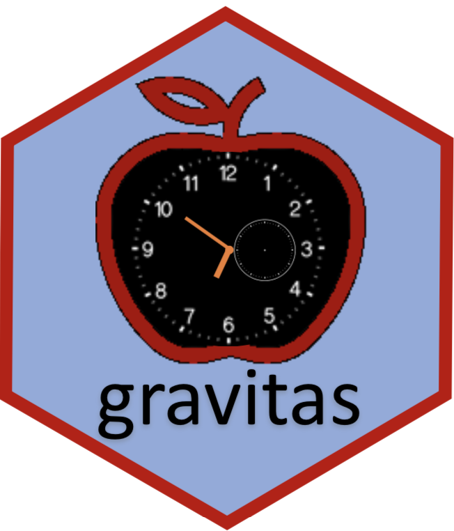

```{r setup, include=FALSE}
library(knitr)
options(htmltools.dir.version = FALSE, tibble.width = 55, tibble.print_min = 4)
opts_chunk$set(
  echo = FALSE, warning = FALSE, message = FALSE, comment = "#>",
  fig.path = 'figure/', cache.path = 'cache/', fig.align = 'center', 
  fig.width = 12, fig.show = 'hold', fig.height = 7, # 16:9
  cache = TRUE, external = TRUE, dev = 'svglite'
)
read_chunk('R/theme.R')
read_chunk('R/main.R')
```

```{r xaringan-themer, include = FALSE}
library(xaringanthemer)
 solarized_light(
   header_font_google = google_font("Josefin Sans"),
   text_font_google   = google_font("Montserrat", "300", "300i"),
   code_font_google   = google_font("Droid Mono"),
   header_color = "#00aba9",
   text_color = "#2b5797"
   # header_color = "#00008B",
   # text_color = "#8B4513"
   
 )
```

# Electricity smart meter technology  (~ 40 billion half hourly observations)

<!-- .pull-left[ -->
<!-- .center-left[ -->
- Source : Department of the Environment and Energy, Australia
<br>
<br>
- Frequency:  Half hourly (interval meter reading (Kwh))
<br>
<br>
- Time Span: 2012 to 2014
<br>
<br>
- Spread: 14K (approx.) households based in Newcastle, New South Wales, and parts of Sydney
<br>
<br>

???
Smart meters record electricity usage (per kWh) every 30 minutes and send this information to the electricity retailer for billing

**Consumers** can save considerable amount on their electricity bill by 
- Switching on their hot water heater or do laundry when energy is cheaper, or when their solar system is generating surplus energy 
- Switching off appliances during peak demands
- Check usage and compare with similar homes 

**Retailers** can reduce costs and increase efficiency
- Lowering metering and connection fees 
- Drawing insights into when customer is home, or sleeping, or even what appliances they are using based on usage figures
- Rewarding customers for mindful usage

Just to give you some perspective I have this data from Department of Energy and Environment, Australia that provides interval meter reading data every 30 minutes from 2012 to 2014. So you can think of it like, that the finest temporal unit here is half hour, whereas the coarsest temporal unit is year. This data is made available for 14k customers located in different local government areas across places.. So this is a data which is spread across both time and space and hence is a spatio-temporal data. 

---
<!-- class: hide-slide-number -->

## Visualize the raw data from from 2012 - 2014 for 50 households

```{r load}

```


```{r motivation3}
```

---
<!-- class: hide-slide-number -->


## Visualize the periodicities in half-hourly energy usage for 1 household from 2012 to 2014

```{r motivation5}
```

---

# Explorartory Data Analysis


```{r dino-saurus}
include_graphics("images/dino-saurus.gif")
```


["Same Stats, Different Graphs: Generating Datasets with Varied Appearance and Identical Statistics through Simulated Annealing"](https://www.autodeskresearch.com/publications/samestats)

<!-- -- [Nick Tierney, WOMBAT2019](https://github.com/njtierney/wombat19) -->


---


background-image: url("images/problem.png")

background-position: center
background-size: contain


???
Well, there can be numerous ways to analyse this data! But I was interested in answering the question - that given this huge volume and spread, how can one explore this data systematically?

---

class: center,middle


##  **Problem** : How do we systematically explore large quantities of temporal data across different deconstructions of time (half-hour, day, type of day, year) to find regular patterns or anomalies in behaviour? 

## **Solution** :  Visualize probability distributions over different time granularities.

???

Developed by **John Tukey** as a way of _*systematically*_ using the tools of statistics on a problem before a hypotheses about the data were developed. This encourages to break the big problem into pieces and focusing on subsets. So the reduced goal that I set for myself is to look at time only and to provide ... . The smart meter example is the one that motivated me for this problem, how the idea is to provide the same for any temporal data following an hierarchy. 

The key terms are decontructing time and visualizing distribution. In the next couples of slides, we will talk about the strength and challenges for each of these. 


---
class: middle center

.animated.bounce[

]

## Visualize probability distributions over different time granularities


---

#  Time granularities
### abstractions of time based on calendar
<br>
.pull-left[

### Arrangement
<br>
 <i> **Linear**</i>  
 - days, weeks, months, years  
<br>

<i> **Cyclic** </i>

 -  <i> **Circular** </i>   day-of-week, month-of-year or hour-of-day  
 -  <i> **Quasi-circular** </i>   day-of-month, week-of-month   
 -  <i> **Aperiodic** </i>  public holidays, school vacations
]

.pull-right[
<!-- # ```{r lineartime, out.width="260%", out.height="300%"} -->
<!-- # ``` -->
<!-- # <br> -->
<!-- # ```{r circulartime, out.width = "100%", out.height="70%"} -->
<!-- # ``` -->
<!-- #  -->

### Order 

- <i>**Single-order-up**</i> second-of-minute, hour-of-day  
<br>
<br>
<br>
- <i>**Multiple-order-up**</i> second-of-hour, hour-of-week  

<!-- # ```{r calendar, out.width="100%"} -->
<!-- #  -->
<!-- # ``` -->
]
---
class:  middle center

##  Data Structure for exploration 


#### Extension of a tsibble - data abstraction for tidy temporal data


<!-- # Computation of granularities -->

<!-- $z$       : index of a tsibble   -->
<!-- <br> -->
<!-- $x$, $y$  : two units in the hierarchy table with  $order(x) <  order(y)$   -->
<!-- <br> -->
<!-- $f(x, y)$ : accessor function for computing the granularity   -->
<!-- <br> -->
<!-- $c(x, y)$ : a constant which relates x and y   -->
<!-- <br> -->

<!-- #### **Single-order-up** -->
<!-- $$f(x, y) = \lfloor z/c(z,x) \rfloor\mod c(x,y)$$ where $y = x+1$ -->


<!-- #### **Multiple-order-up** -->


<!-- \begin{split} -->
<!-- f(x,y) & = \sum_{i=0}^{order(y) - order(x) - 1} c(x, x+i)(f(x -->
<!--   +i, x+i+1) - 1)\\ -->
<!-- \end{split} -->


---
## Relationship of cyclic granularities

**Harmonies** : pairs of granularities that aid exploratory data analysis  
**Clashes**   : pairs leading to structurally empty sets  

```{r clash, out.width="100%"}

```

---

## Summarising probability distributions


#### Types of statistical distribution plots 


```{r allplot}
```


---


# R package: **gravitas**

.center[
### Computation
--- 

.left[
Compute any cyclic granularity? <span style="color:Red">`create_gran()`
 <br>
 <br>
 
Exhaustive list of granularities to explore? <span style="color:Red"> `search_gran()`
 <br>
       ]

]
 
.pull-left[
 ### Interaction
 --- 
 
Check if cyclic granularities are harmonies/clashes?  `is.harmony()`
<br>
<br>
List of harmonies to explore? `harmony()`
<br>
 ]

.pull-right[
### Visualization
--- 

Possible probability distributions plots for harmonies?  `prob_plot()`
<br>
<br>
Sufficient observations?  `gran_obs()`  
Recommendation on a harmony? `gran_advice()`

 ]

---

<!-- class: center,middle -->

<!-- # <span style="color:MediumVioletRed"> Package gravitas </span> -->

<!-- ##   granularity visualization of time series data  -->


.left-column[
## smart meter example
#### - the data
]
.right-column[
```{r read}
```
<i><small>Data source</i></small> : [<small><i>Department of the Environment and Energy, Australia</i></small>](https://data.gov.au/dataset/4e21dea3-9b87-4610-94c7-15a8a77907ef)

]
---

.left-column[
## smart meter example
#### - the data
#### - possible cyclic granularities `search_gran()`
]
.right-column[

```r
smart_meter %>%
* search_gran(lowest_unit = "hhour", highest_unit =  "month")
```
.pull-left[
```{r search_gran}
```
]

.pull-right[

<large>  So there are $^{6} P_2$ =  `r length(combn(6,2))` pair of granularities to look at.
]
]
---

.left-column[
## smart meter example
#### - the data
#### - possible cyclic granularities `search_gran()`
#### - set of harmonies `harmony()`
]
.right-column[

```r
smart_meter %>% 
* harmony(ugran = "month", lgran = "hhour",
*          filter_out = c("fortnight", "hhour"))
```

```{r harmony}
```
### <large>  Good news! Only 13 out `r length(combn(6,2))` are harmonies </large>
]
---

.left-column[
## smart meter example
#### - the data
#### - possible cyclic granularities `search_gran()`
#### - set of harmonies `harmony()`
#### - advice `gran_advice()`
]
.right-column[

```r
smart_meter %>% 
*  gran_advice("month_year", "hour_day")
```

```{r gran-advice}
```
### <span style="color:Orange"><large>  Quantile plots recommended for the harmony pair (month_year, hour_day) </large>
]

---
.left-column[
## smart meter example
#### - the data
#### - possible cyclic granularities `search_gran()`
#### - set of harmonies `harmony()`
#### - advice `gran_advice()`
#### - visualize harmonies `prob_plot()`
]
.right-column[

```r
smart_meter %>% 
* prob_plot("month_year","hour_day",
*           plot_type = "quantile", 
*           response = "general_supply_kwh",
*           quantile_prob = c(0.05, 0.1, 0.25, 
*                             0.5, 0.75, 0.9, 0.95)
```

```{r granplotoverlay3}
```
]

---

## Another example: Cricket data of Indian Premier League

<small><i>Data source</i></small>: [<small><i>Cricsheet</i></small>](http://cricsheet.org/) ,  [<small><i>Kaggle</i></small>](https://www.kaggle.com/josephgpinto/ipl-data-analysis/data)

```{r cricket}
```

---


## Difference in strategy between two top teams


```{r cricketex}
```

---
class: center, middle


### Special thanks to

.pull-left[
.portrait[

Di Cook
]

NUMBATS
]


.pull-right[
.portrait[

Rob J Hyndman
]
####  More Information

Package: [gravitas 0.1.0 on CRAN](https://cran.r-project.org/web/packages/gravitas/index.html)  
Code: https://github.com/Sayani07/gravitas  
Slides: https://sayanigupta-ysc.netlify.com/  

<span style="color: White"> Slides created with <span style="color: Crimson"><i> Rmarkdown, knitr, xaringan, xaringanthemer</i>


]


